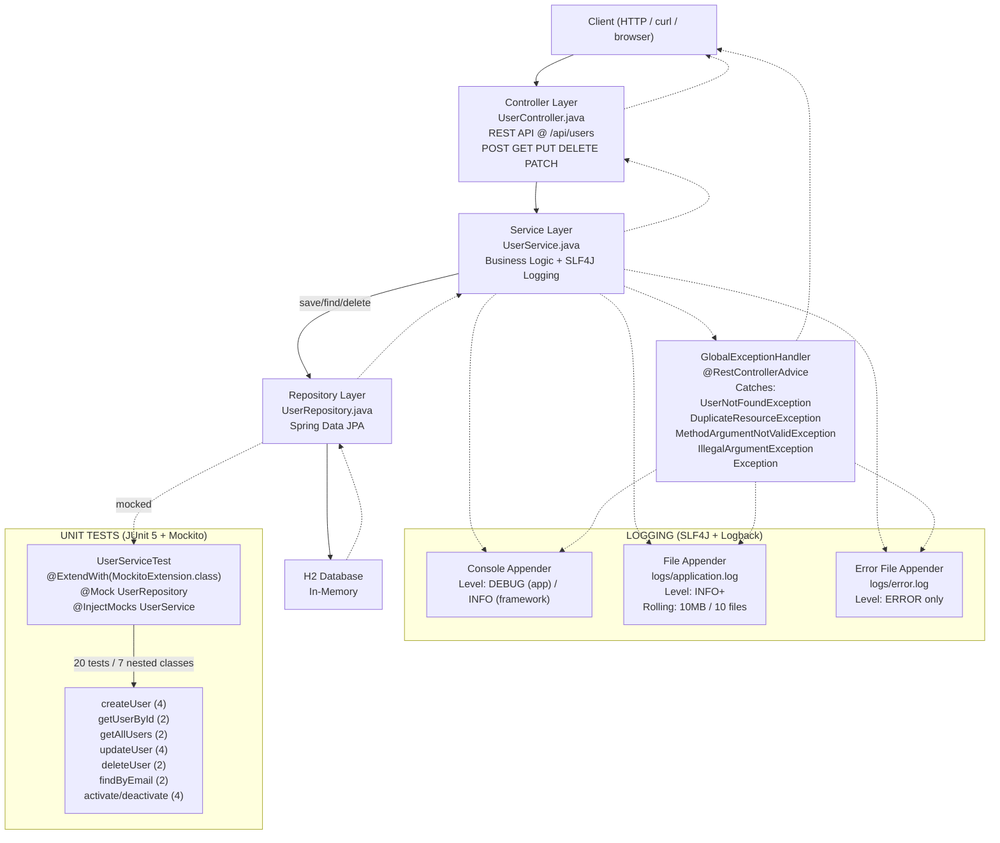

## 🏗️ Project Architecture

```mermaid
flowchart TD
    Client["Client (HTTP / curl / browser)"] --> Controller["Controller Layer<br>UserController.java<br>REST API @ /api/users<br>POST GET PUT DELETE PATCH"]

    Controller --> Service["Service Layer<br>UserService.java<br>Business Logic + SLF4J Logging"]

    Service -->|save/find/delete| Repository["Repository Layer<br>UserRepository.java<br>Spring Data JPA"]

    Repository --> Database["H2 Database<br>In-Memory"]

    Service -.-> ExceptionHandler["GlobalExceptionHandler<br>@RestControllerAdvice<br>Catches:<br>UserNotFoundException<br>DuplicateResourceException<br>MethodArgumentNotValidException<br>IllegalArgumentException<br>Exception"]

    ExceptionHandler -.-> Client
    Database -.-> Repository
    Repository -.-> Service
    Service -.-> Controller
    Controller -.-> Client

    subgraph LoggingSystem["LOGGING (SLF4J + Logback)"]
        L1["Console Appender<br>Level: DEBUG (app) / INFO (framework)"]
        L2["File Appender<br>logs/application.log<br>Level: INFO+<br>Rolling: 10MB / 10 files"]
        L3["Error File Appender<br>logs/error.log<br>Level: ERROR only"]
    end

    Service -.-> L1
    Service -.-> L2
    Service -.-> L3

    ExceptionHandler -.-> L1
    ExceptionHandler -.-> L2
    ExceptionHandler -.-> L3

    subgraph Testing["UNIT TESTS (JUnit 5 + Mockito)"]
        Test["UserServiceTest<br>@ExtendWith(MockitoExtension.class)<br>@Mock UserRepository<br>@InjectMocks UserService"]

        Test -->|20 tests / 7 nested classes| TestCases["createUser (4)<br>getUserById (2)<br>getAllUsers (2)<br>updateUser (4)<br>deleteUser (2)<br>findByEmail (2)<br>activate/deactivate (4)"]
    end

    Repository -.->|mocked| Test
```
